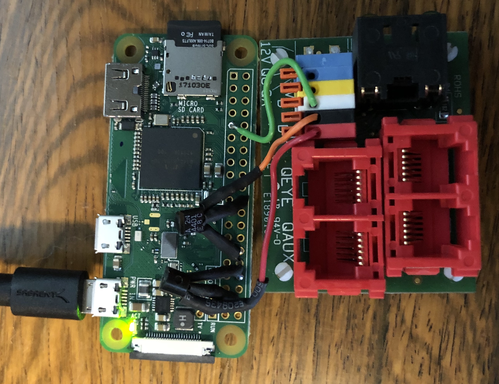

# GPIO-driven Motorized Tension Screens

The plugin supports screens which can be operated by momentary closure of dry contacts (signaling up, down, and stop commands).  An example includes DaLite motorized screens.

## Command Protocol

GPIO-driven screens lack positional feedback or command responses. As such it is impossible to determine if the
command has been accepted, rejected, is in progress or has completed.

## Hardware setup

I'm running the projection screen with a [Raspberry Pi Zero W](https://www.raspberrypi.org/products/raspberry-pi-zero-w/) with two transistors used to connect the `up`/`down` with the `common` connections on the projector control board.  The control is simple: close the circuit between `up` and `common` to raise, `down` and `common` to lower, and both simultaneously to stop.  

In my case I'm using GPIO outputs connected to 1kOhm resistors driving the base of two 2N4401 transistors.  Both the transistors' emitters and the projector control board's `common` connection all tied to ground on the Pi.  Twin relays would work as well.  An example of the screen controller GPIO interface with a Pi Zero W:




## Software installation

```bash
sudo npm install -g homebridge-screen --unsafe-perm
```

## Configure homebridge

In you config.json, add the following configuration for the projection screen:

```json
{
  "bridge": {
    "name": "Homebridge Screen Example",
    "username": "A9:B9:C9:D9:E9:F9",
    "port": 54732,
    "pin": "135-79-864"
  },
  "platforms": [
    {
      "platform": "Screen",
      "screens": [
        {
	"name": "MyScreen",
	"model": "GPIOScreen",
	"pinup": 32,
	"pindown": 36,
	"writeTime": 1,
	"screenDeployTime": 12
        }
      ]
    }
  ]
}
```

- pinup/pindown: the _physical_ pin numbers which close the contacts to control the screen (up or down).  Activating both pins simultaneously stops the screen motion.
- writeTime: time in seconds to pull pins high (optional: default 1 second)
- screenDeployTime: time in seconds it takes screen to deploy (optional: default 20 seconds)

The above example is runnable with the hardware setup described above.

## What it looks like

If you've set up everything correctly, you'll see the projection screen as a window covering in HomeKit.

## Positioning

With the above configuration you'll be able to control the screen from HomeKit.  It does, however, not update HomeKit if you use a remote to move the screen, as the protocol has no feedback. Typically, sending the same command twice (e.g. close), has no effect.  In order to enable automatic updates to the position information, see [this doc](hivilux.md) for ideas.
